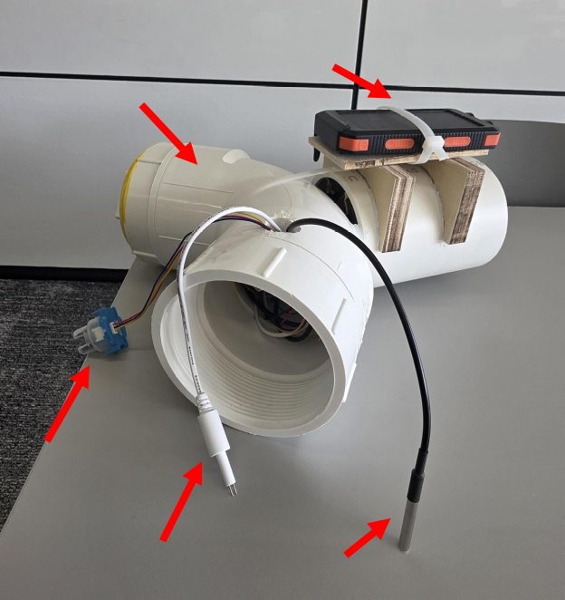
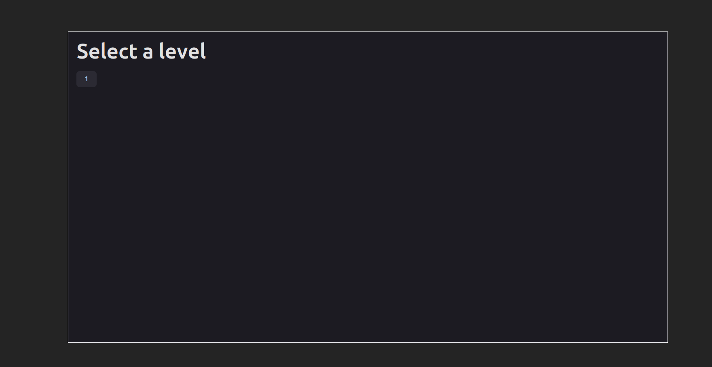
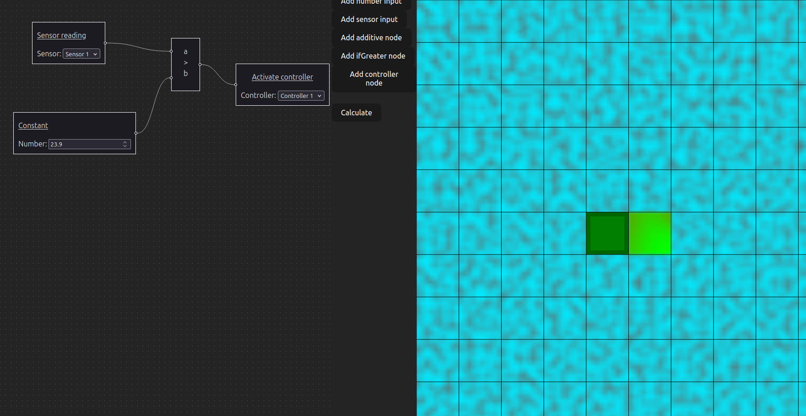
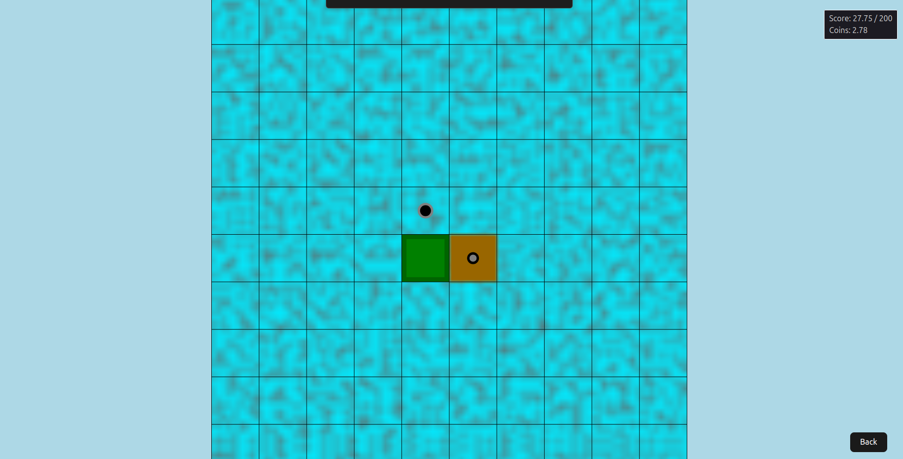

# The Flying Dutchman

The Flying Dutchman is a device used to monitor water quality and properties. It is designed to be self-sufficient and can operate on its own using solar power. The goals of the Flying Dutchman are the following:

1. Collect water quality data
2. Send the water quality data to a Node-RED server in South Africa
3. Display the water quality data on a website using the data stored on the Node-RED server

The Flying Dutchman collects data for the following water properties:

1. Temperature
2. Total Dissolved Solids
3. Turbidity

The Flying Dutchman can be used to monitor a wide range of water sources, due to it being a self-sufficient device. It can be used in a lake, pond, reservoir, etc. Because of the water properties it measures, The Flying Dutchman is also well-suited for use in hydroponics systems. This is because the sensors on board The Flying Dutchman track important water quality features that are relevant to plant growth.

## Components:

1. **PVC**: houses the electronics 
2. **Solar-Powered Battery Pack**: provides power to the electronics 
3. **ESP32 (not pictured)**: microcontroller that controls the sensors and sends data  
4. **Temperature Sensor**: measures the amount of heat in the water 
5. **TDS Sensor**: measures the amount of dissolved material in the water 
6. **Turbidity Sensor**: measures the clarity of the water. 

# The interactive game

There is also a shipped, interactive game available [here](../t4/). The player can learn programming from a high-level perspective by writing code in a graph structure. It is currently still in development, but is highly extensible, and players write code that responds to various temperature readings to keep their farm unit alive.

## Level selection screen

The level selection screen allows players to pick levels to play. A level is only playable if all levels before it have been completed.

## The programming screen

The programming screen is where the player can choose to place nodes
The solution displayed in the graph is the intended solution for level 1.

## The game screen

The game screen is where the player's code gets executed in real time. The player wins when they achieve the target score (visible at the top right), and loses if:

- Their coins go below zero
- The farm dies due to overheating or freezing.

On the game view itself (in the middle), you can see:

- Farm unit (green block):
    - Represents a collection of plants housed in a grid square. Dies if temperature goes outside of safe boundaries.
    - You lose if you run out of farm units.
- Controller (above the farm unit):
    - Uses coins and score when it runs
    - While it runs, it ensures temperatures stay within safe ranges for up to 1 square away.
- Sensor (to the right of the farm unit):
    - Reports maximum sensor reading in the graph, in around a ~1.5 grid square radius.
    - Displays a temperature map on the game screen, ranging from blue (way too cold) -> green (good) -> red (way too hot).
